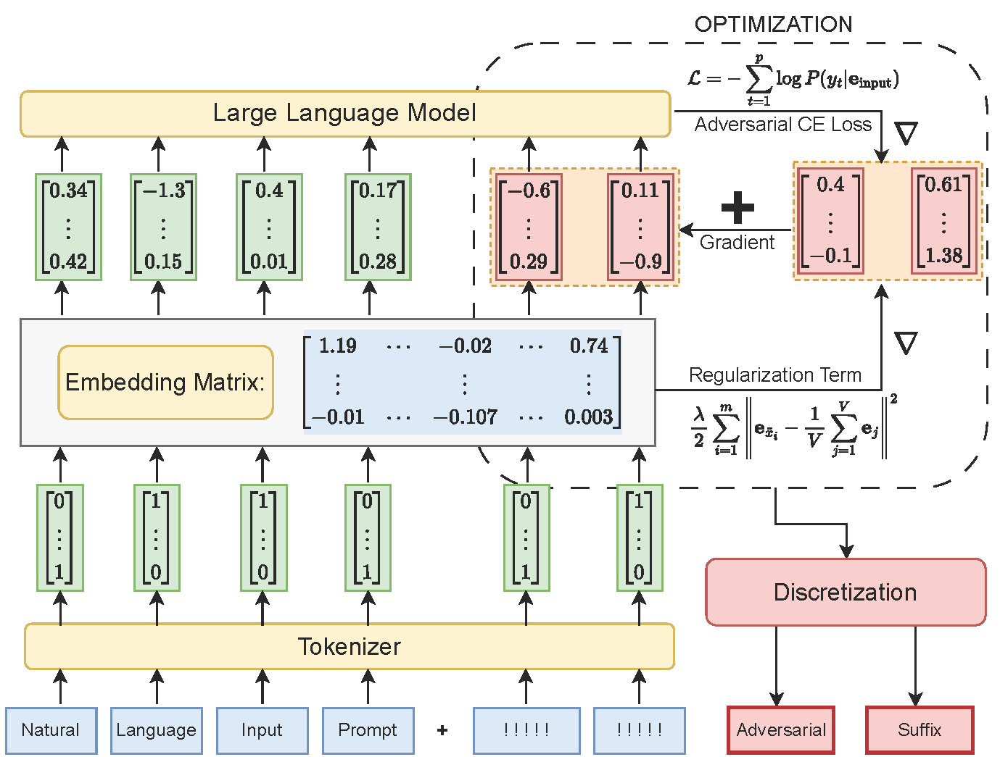

# **Adversarial Attacks on Large Language Models Using Relaxed Optimization**


### Update: Our paper is now available [here](https://arxiv.org/abs/2410.19160)!
## 📄 Overview  
This project explores novel adversarial attack techniques on **large language models (LLMs)** using **relaxed token embedding optimization**. Our approach combines **continuous-space optimization** with a **regularization term**, ultimately producing **discrete adversarial tokens**. These tokens are effective at **jailbreaking** state-of-the-art LLMs, bypassing safety mechanisms, and eliciting harmful or unexpected responses.

The project demonstrates **superior performance** over existing attack methods, achieving higher **attack success rates** while also achieving **upto two orders of magnitude faster runtimes**. Additionally, we analyze the **transferability** of these attacks across multiple models, with **Llama2** and four other open-source LLMs using various datasets.

---

## 📂 Project Structure  
```plaintext
├── data/                           # Datasets used for training and evaluation
├── figures/                        # Plots and figures from the paper
├── average_token_embedding.ipynb   # Notebook to plot the average token embedding for each model
├── behavior.py                     # Define the Behavior and RRBehavior classes
├── config.py                       # Configuration files for running experiments
├── helper.py                       # Helper files for running experiments
├── parse_results.ipynb             # Scripts to parse the generated responses
├── pgd.py                          # PGD script to attack a single behavior
├── reg-relaxation-demo.ipynb       # Regularized Relaxation demo notebook
├── req.txt                         # Requirements file
├── result.py                       # Define the Result class
├── rr.py                           # RR script to attack a single behavior
├── run_attack.py                   # Python script to evaluate any of the attack methods
├── run_attack.sh                   # Shell script to automate evaluations
├── run_gcg.py                      # Python script to evaluate GCG
├── run_gcg.sh                      # Shell script to automate GCG evaluation
├── softprompt.py                   # SoftPrompt script to attack a single behavior
├── README.md                       # Project description and usage instructions
└── LICENSE                         # License information (if applicable)
```

## 🛠️ Installation & Setup
To run the experiments locally, follow these steps:

- Clone the Repository:
```
git clone https://github.com/sj21j/Regularized_Relaxation.git
cd Regularized_Relaxation
```
- Create and activate your virtual environment

- Install Dependencies:
```pip install -r req.txt```

- Download the Pre-trained models from HuggingFace and place them in the appropriate directory

## 🧪 How to Run Experiments [check run_attack.sh for actual field names]

1. Optimize Adversarial Suffix for 1 behavior:
```
 python run_attack.py \
     --input_file "path-to-input-csv-file" \
     --output_file "output-file-name.jsonl" \
     --model "model_name" \
     --attack_name "method_name" \
     --num_behaviors "1"
```
2. Optimize Adversarial Suffix for multiple behaviours:
```
chmod +x run_attack.sh
./run_attack.sh
```
3. Optimize Adversarial Suffix using GCG:
```
chmod +x run_gcg.sh
./run_gcg.sh
```
4. Evaluate Attack Success Rate: 
Collect all generated .jsonl files and use parse_results.ipynb to get the ASR


## 📊 Key Results
1. Runtime Comparison:
Our method achieves upto 2 orders of magnitude speedup compared to the SOTA gradient-based attacks.
 of our method compared to SOTA gradient-based attack techniques, averaged over multiple models and datasets.")

2. Attack Success Rate:
Outperforms all other methods in success rate across multiple models and datasets.

3. Transferability:
Llama2 adversarial tokens effectively transfer to Vicuna and other open-source models.

## 🛡️ Future Work
Robustness Evaluation: Assess how these attacks perform under real-world adversarial settings.

## 📜 License
This project is licensed under the MIT License – see the LICENSE file for details.

## 🤝 Acknowledgments
We thank the authors of [GCG](https://arxiv.org/abs/2307.15043) for their inspiring work on adversarial attacks used in this research.

## ⭐ Contributing
Contributions are welcome! If you'd like to improve the project or add new features, please submit a pull request or open an issue.
